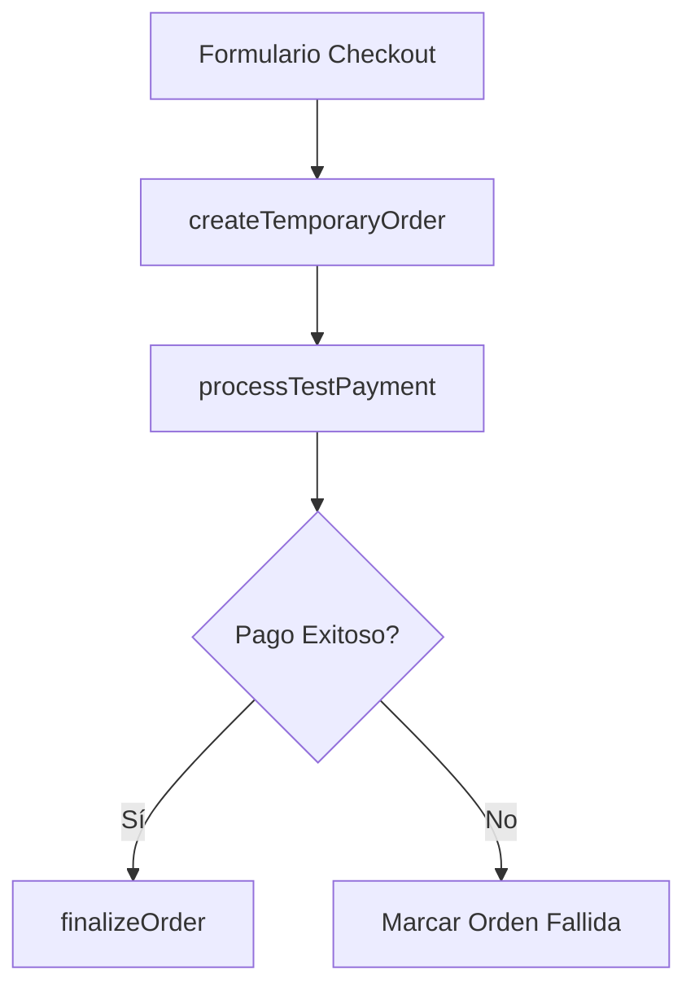

# Flujo de Checkout

## Objetivo
Implementar un proceso de checkout funcional y robusto que permita procesar pedidos de prueba correctamente.

## Estructura

### 1. Servicio de Checkout (`src/services/checkoutService.ts`)
Centraliza toda la lógica de checkout en un solo lugar, separado de los componentes UI.

```typescript
interface CheckoutService {
  createTemporaryOrder(orderData: OrderData): Promise<Order>;
  processTestPayment(orderId: string): Promise<PaymentResult>;
  finalizeOrder(orderId: string, paymentResult: PaymentResult): Promise<Order>;
}
```

### 2. Flujo de Datos


## Proceso Paso a Paso

1. **Crear Orden Temporal**
   - Guardar toda la información del formulario en metadata
   - Estado inicial: payment_pending
   - No crear cliente todavía

2. **Procesar Pago de Prueba**
   - Simular proceso de pago
   - Actualizar payment_status según resultado

3. **Finalizar Orden (Solo si pago exitoso)**
   - Crear cliente con información guardada
   - Actualizar orden con customer_id
   - Actualizar estado a processing

## Manejo de Errores
- Validación de datos antes de crear orden
- Rollback si falla el pago
- Logs claros para debugging

## Implementación

1. Crear `checkoutService.ts`
2. Refactorizar Cart.tsx para usar el servicio
3. Eliminar lógica de negocio del componente
4. Mantener UI separada de la lógica

## Testing
- Probar flujo completo con datos de prueba
- Verificar manejo de errores
- Validar estados de orden